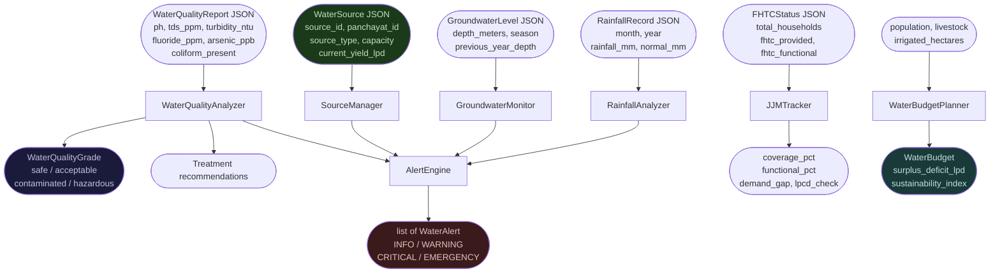

# aumai-jaldrishti

**Water resource management AI for the Jal Jeevan Mission and rural India.**

Part of the [AumAI](https://github.com/aumai) open-source infrastructure suite — 88 packages for production agentic AI.

> **IMPORTANT DISCLAIMER: This tool provides estimates only. Verify with local water resource authorities and certified laboratory testing before making any water safety or infrastructure decisions.**

---

## What Is This, In Plain English?

"Jal" means water in Hindi. "Drishti" means vision or sight. Together, jaldrishti is a data-driven eye on a panchayat's water situation.

Think of a village doctor who runs five tests at a health camp: blood pressure, temperature, blood sugar, oxygen saturation, and a CBC. She does not treat each number in isolation — she looks at the complete picture and tells you: "your blood pressure and blood sugar together suggest pre-diabetes; here is what to do." She also ranks urgency: the dangerously low oxygen needs treatment today; the slightly elevated blood pressure can be monitored.

`aumai-jaldrishti` does the same for a panchayat's water supply:

| Test | What the doctor checks | What jaldrishti checks |
|---|---|---|
| Blood quality | pH, blood sugar, minerals | pH, TDS, fluoride, arsenic, nitrate, coliform |
| Vital signs | BP, temperature | Groundwater depth, monsoon rainfall |
| Coverage | Are all organs working? | How many households have functional tap connections? |
| Capacity | Can the body sustain the load? | Is supply enough for 55 LPCD for the entire population? |
| Trend | Is the patient getting worse? | Is the water table declining year-over-year? |

It applies published Indian standards — BIS 10500:2012, Jal Jeevan Mission 55 LPCD, IMD drought classification, CGWB groundwater categories — automatically, and generates prioritised alerts from INFO to EMERGENCY so that officials know exactly what to act on first.

---

## Why First Principles

India's Jal Jeevan Mission (JJM) aims to provide every rural household with a Functional Household Tap Connection (FHTC) delivering 55 litres per capita per day (LPCD) of safe water. Meeting that goal requires knowing five things at the panchayat level:

1. How many tap connections exist and how many are actually working?
2. Is the water safe to drink according to BIS 10500:2012 standards?
3. Is the groundwater level sustainable, or declining year over year?
4. Was rainfall sufficient this monsoon, or is drought imminent?
5. Does total water availability cover domestic + agricultural + livestock demand?

Without software, answering these five questions requires manual data collection, manual arithmetic against printed standard tables, and manual prioritisation — work that most block and panchayat officials cannot complete fast enough to prevent crises.

`aumai-jaldrishti` automates all five. Every number is compared to a published standard (cited in the code). Every alert message tells the responsible person not just what is wrong, but what to do about it.

---

## Architecture



### Component Map

| Component | Class | Standards Applied |
|---|---|---|
| Quality analysis | `WaterQualityAnalyzer` | BIS 10500:2012 |
| Source management | `SourceManager` | — |
| JJM tracking | `JJMTracker` | JJM 55 LPCD |
| Groundwater monitoring | `GroundwaterMonitor` | CGWB depth categories |
| Rainfall analysis | `RainfallAnalyzer` | IMD drought classification |
| Budget planning | `WaterBudgetPlanner` | JJM 55 LPCD, field estimates |
| Alert generation | `AlertEngine` | All of the above |

---

## Features

- **BIS 10500:2012 compliance grading** — grades each water report as `safe`, `acceptable`, `contaminated`, or `hazardous` against published Indian drinking water standards for pH, TDS, turbidity, fluoride, arsenic, iron, nitrate, chloride, and coliform
- **Treatment recommendations** — for each failing parameter, recommends the right technology: chlorination/UV, RO, defluoridation (alumina/bone char), arsenic removal, aeration+filtration, sand filtration, ion exchange, pH correction
- **Contaminant identification** — lists every parameter exceeding BIS acceptable limits with measured value and limit
- **JJM FHTC tracker** — records Functional Household Tap Connection data per panchayat; computes coverage %, functional %, demand gap, and LPCD check against 55 LPCD standard
- **Groundwater monitoring** — seasonal depth records, year-over-year change, multi-year declining trend detection, CGWB depth category, monsoon recharge potential estimate
- **Rainfall analysis** — annual total vs normal, deviation %, IMD drought classification (normal/mild/moderate/severe), flood risk, monsoon (June–September) performance
- **Water budget planning** — domestic + agricultural + livestock demand from population and land inputs; 0–100 sustainability index; supply surplus/deficit
- **Alert engine** — four severity levels (INFO / WARNING / CRITICAL / EMERGENCY) generated from quality, groundwater, supply LPCD, and rainfall data
- **Nine water source types**: borewell, handpump, open well, river, pond, spring, reservoir, rainwater, pipeline
- **Full Click CLI**: `source`, `quality`, `fhtc`, `groundwater`, `rainfall`, `budget`
- **Pydantic v2** validation on all input/output models
- **Zero external runtime dependencies** beyond Pydantic and Click

---

## Installation

```bash
pip install aumai-jaldrishti
```

Python 3.11+ required.

---

## Quick Start: CLI

### Analyse water sources

Create `sources.json`:

```json
[
  {
    "source_id": "SRC-001",
    "panchayat_id": "PAN-RAJPUR",
    "name": "Main Borewell",
    "source_type": "borewell",
    "latitude": 28.6,
    "longitude": 77.2,
    "capacity_liters_per_day": 50000,
    "current_yield_lpd": 38000,
    "depth_meters": 45,
    "is_functional": true,
    "last_tested_date": "2025-11-01"
  }
]
```

```bash
jaldrishti source --input sources.json
```

### Analyse water quality

Create `quality.json`:

```json
{
  "report_id": "RPT-001",
  "source_id": "SRC-001",
  "test_date": "2025-11-01",
  "ph": 7.2,
  "tds_ppm": 420,
  "turbidity_ntu": 0.8,
  "fluoride_ppm": 1.6,
  "arsenic_ppb": 2,
  "iron_ppm": 0.1,
  "nitrate_ppm": 30,
  "coliform_present": false,
  "grade": "hazardous"
}
```

```bash
jaldrishti quality --input quality.json
```

Output (example):

```
Source SRC-001 | Date: 2025-11-01
  Grade: HAZARDOUS
  pH: 7.2 | TDS: 420 ppm | Turbidity: 0.8 NTU
  Issues:
    - Fluoride: 1.6 ppm (limit 1.0)
  Recommended treatment:
    - Activated alumina or bone char defluoridation

Verify water quality data with local authorities and laboratory testing before making decisions.
```

### Track JJM FHTC coverage

```bash
jaldrishti fhtc --input fhtc.json
```

### Monitor groundwater

```bash
jaldrishti groundwater --input groundwater.json --panchayat PAN-RAJPUR
```

### Rainfall and drought risk

```bash
jaldrishti rainfall --input rainfall.json --panchayat PAN-RAJPUR --year 2025
```

### Estimate water budget

```bash
jaldrishti budget --population 2500 --livestock 300 --irrigated-ha 80 --supply-lpd 150000
```

---

## Quick Start: Python API

```python
from aumai_jaldrishti import (
    WaterQualityAnalyzer, AlertEngine, JJMTracker, WaterBudgetPlanner,
    WaterQualityReport, FHTCStatus, WaterQualityGrade,
)

# Analyse water quality
analyzer = WaterQualityAnalyzer()
report = WaterQualityReport(
    report_id="RPT-001", source_id="SRC-001", test_date="2025-11-01",
    ph=7.2, tds_ppm=420, turbidity_ntu=0.8,
    fluoride_ppm=1.6, arsenic_ppb=2, iron_ppm=0.1,
    nitrate_ppm=30, coliform_present=False,
    grade=WaterQualityGrade.HAZARDOUS,
)
grade = analyzer.grade_report(report)
print(f"Grade: {grade.value}")                 # hazardous
issues = analyzer.identify_contaminants(report)
print(issues)                                  # ['Fluoride: 1.6 ppm (limit 1.0)']
treatments = analyzer.recommend_treatment(report)
print(treatments)                              # ['Activated alumina or bone char...']

# Generate alerts
engine = AlertEngine()
alerts = engine.check_quality(report)
for alert in alerts:
    print(f"[{alert.level.value.upper()}] {alert.message}")
```

---

## Full CLI Reference

### `jaldrishti source`

Register and analyse water sources for a panchayat.

```
Options:
  --input PATH   JSON: single WaterSource or list of WaterSource  [required]
  --help
```

### `jaldrishti quality`

Analyse water quality reports against BIS 10500:2012.

```
Options:
  --input PATH   JSON: single WaterQualityReport or list  [required]
  --help
```

### `jaldrishti fhtc`

Track Jal Jeevan Mission FHTC coverage.

```
Options:
  --input PATH   JSON: single FHTCStatus or list  [required]
  --help
```

### `jaldrishti groundwater`

Monitor groundwater levels and trends.

```
Options:
  --input PATH        JSON: list of GroundwaterLevel  [required]
  --panchayat TEXT    Panchayat ID to report on  [required]
  --help
```

### `jaldrishti rainfall`

Analyse rainfall patterns and drought/flood risk.

```
Options:
  --input PATH        JSON: list of RainfallRecord  [required]
  --panchayat TEXT    Panchayat ID  [required]
  --year INTEGER      Year to analyse  [required]
  --help
```

### `jaldrishti budget`

Estimate water demand and sustainability index.

```
Options:
  --population     INTEGER   Village population  [required]
  --livestock      INTEGER   Livestock count (large animals)  [default: 0]
  --irrigated-ha   FLOAT     Irrigated area in hectares  [default: 0.0]
  --supply-lpd     FLOAT     Current total supply in litres/day  [default: 0.0]
  --help
```

---

## Python API Examples

### Full quality analysis workflow

```python
from aumai_jaldrishti import WaterQualityAnalyzer, WaterQualityReport, WaterQualityGrade

analyzer = WaterQualityAnalyzer()
report = WaterQualityReport(
    report_id="R002", source_id="HW-12", test_date="2025-10-15",
    ph=6.1,          # below BIS acceptable 6.5 — contaminated
    tds_ppm=650,     # above acceptable 500, below permissible 2000 — contaminated
    turbidity_ntu=3, # above acceptable 1, below permissible 5 — contaminated
    fluoride_ppm=0.8, arsenic_ppb=0, iron_ppm=0.2,
    nitrate_ppm=20, chloride_ppm=80, coliform_present=False,
    grade=WaterQualityGrade.HAZARDOUS,
)
grade = analyzer.grade_report(report)       # WaterQualityGrade.CONTAMINATED
issues = analyzer.identify_contaminants(report)
# ['pH too low: 6.1 (min 6.5)', 'TDS: 650 ppm (limit 500)', 'Turbidity: 3 NTU (limit 1)']
treatments = analyzer.recommend_treatment(report)
# ['Reverse osmosis (RO) for high TDS', 'Slow sand filtration ...', 'Lime dosing to raise pH']
```

### JJM tracking across multiple panchayats

```python
from aumai_jaldrishti import JJMTracker, FHTCStatus

tracker = JJMTracker()
tracker.update(FHTCStatus(panchayat_id="PAN-A", panchayat_name="Rajpur",
    total_households=500, fhtc_provided=350, fhtc_functional=300,
    target_date="2024-03-31", report_date="2025-11-01"))
tracker.update(FHTCStatus(panchayat_id="PAN-B", panchayat_name="Krishnanagar",
    total_households=800, fhtc_provided=800, fhtc_functional=720,
    target_date="2024-03-31", report_date="2025-11-01"))

summary = tracker.coverage_summary()
print(f"Avg coverage: {summary['avg_coverage_pct']}%")      # 93.8%
print(f"Avg functional: {summary['avg_functional_pct']}%")  # 90.0%

below = tracker.below_target(100.0)   # panchayats not fully covered
for s in below:
    gap = tracker.demand_gap(s.panchayat_id)
    print(f"  {s.panchayat_name}: {gap} households still without tap")
```

### Groundwater trend analysis

```python
from aumai_jaldrishti import GroundwaterMonitor, GroundwaterLevel, SeasonType

monitor = GroundwaterMonitor()
readings = [
    (2022, SeasonType.PRE_MONSOON,  12.0, 0.0),
    (2022, SeasonType.POST_MONSOON,  7.5, 0.0),
    (2023, SeasonType.PRE_MONSOON,  14.5, 12.0),
    (2023, SeasonType.POST_MONSOON,  9.0, 7.5),
    (2024, SeasonType.PRE_MONSOON,  17.2, 14.5),
]
for year, season, depth, prev in readings:
    monitor.add(GroundwaterLevel(
        panchayat_id="PAN-A", season=season, year=year,
        depth_meters=depth, previous_year_depth=prev,
    ))

print(monitor.declining_trend("PAN-A", years=3))    # True
print(monitor.recharge_potential("PAN-A"))           # "moderate"
print(monitor.categorize_level(17.2))               # "moderate"
latest = monitor.latest("PAN-A")
print(f"Change: {latest.change_meters:+.1f}m")      # +2.7m
```

### Rainfall and drought analysis

```python
from aumai_jaldrishti import RainfallAnalyzer, RainfallRecord

analyzer = RainfallAnalyzer()
# Load 12 months of data
monthly = [
    (1, 5.0, 12.0), (2, 8.0, 15.0), (3, 12.0, 18.0), (4, 10.0, 22.0),
    (5, 18.0, 25.0), (6, 45.0, 120.0), (7, 88.0, 210.0), (8, 62.0, 200.0),
    (9, 35.0, 110.0), (10, 22.0, 38.0), (11, 8.0, 14.0), (12, 4.0, 10.0),
]
for month, actual_mm, normal_mm in monthly:
    analyzer.add(RainfallRecord(
        panchayat_id="PAN-A", month=month, year=2024,
        rainfall_mm=actual_mm, normal_mm=normal_mm,
    ))

print(f"Annual total:  {analyzer.annual_total('PAN-A', 2024):.0f} mm")
print(f"Annual normal: {analyzer.annual_normal('PAN-A', 2024):.0f} mm")
print(f"Deviation:     {analyzer.annual_deviation_pct('PAN-A', 2024):+.1f}%")
print(f"Drought risk:  {analyzer.drought_risk('PAN-A', 2024)}")
monsoon = analyzer.monsoon_performance("PAN-A", 2024)
print(f"Monsoon: {monsoon['actual_mm']:.0f} mm vs {monsoon['normal_mm']:.0f} mm normal")
```

---

## Technical Deep-Dive

### Water Quality Grading Logic (BIS 10500:2012)

`WaterQualityAnalyzer.grade_report` uses a two-flag pattern derived from BIS 10500's two-tier limit structure:

**Hazardous flag** is raised by: pH < 5.0 or > 9.5; TDS > 2000 ppm; fluoride > 1.5 ppm; arsenic > 10 ppb; nitrate > 45 ppm; coliform bacteria present.

**Contaminated flag** is raised by: pH outside 6.5–8.5; TDS > 500 ppm; turbidity > 5 NTU; fluoride > 1.0 ppm; iron > 1.0 ppm.

Priority: `HAZARDOUS` > `CONTAMINATED` > `ACCEPTABLE` > `SAFE`. Any single hazardous parameter overrides everything else.

### Alert Severity Thresholds

| Condition | Level |
|---|---|
| Hazardous water quality | EMERGENCY |
| Supply < 27 LPCD (half JJM standard) | EMERGENCY |
| Groundwater depth > 40m | CRITICAL |
| Drought deviation ≤ -40% or flood deviation ≥ +60% | CRITICAL |
| Contaminated water quality | WARNING |
| Groundwater depth 20–40m | WARNING |
| Year-over-year groundwater drop > 2m | WARNING |
| Supply < 55 LPCD (below JJM standard) | WARNING |

### Groundwater Categories (CGWB)

| Depth | Category |
|---|---|
| < 2m | `very_shallow` |
| 2–8m | `shallow` |
| 8–20m | `moderate` |
| 20–40m | `deep` |
| > 40m | `very_deep` |

### IMD Drought Classification

| Annual deviation | Classification |
|---|---|
| ≤ -60% | `severe_drought` |
| ≤ -40% | `moderate_drought` |
| ≤ -20% | `mild_drought` |
| > -20% | `normal` |

### Water Budget Demand Constants

| Constant | Value | Source |
|---|---|---|
| Domestic | 55 LPCD | JJM guideline |
| Livestock | 30 L/animal/day | Field standard |
| Irrigation | 500 mm/ha/season | Average estimate |

---

## Integration Table

| Use Case | Key Classes | Notes |
|---|---|---|
| Field water testing workflow | `WaterQualityAnalyzer`, `AlertEngine` | Grade + contaminants + treatments + alerts in one pass |
| JJM dashboard | `JJMTracker` | coverage_pct, functional_pct, demand_gap per panchayat |
| Groundwater surveillance | `GroundwaterMonitor`, `AlertEngine` | Seasonal depth + trend + recharge potential |
| Drought early warning | `RainfallAnalyzer`, `AlertEngine` | Annual + monsoon deviation, IMD classification |
| Village water planning | `WaterBudgetPlanner` | Demand estimation + sustainability index |
| Multi-source panchayat | `SourceManager` | Total supply, low-yield sources, functional sources |

---

## Disclaimer

> **This tool provides estimates only. Verify with local water resource authorities before making decisions.**
>
> Water quality grades are computed from parameters you supply. The accuracy of the grade depends entirely on the accuracy of your input data. This software does not replace certified laboratory testing under BIS 10500:2012 or any applicable state standards. Decisions affecting drinking water safety must involve qualified water engineers and local authorities.

---

## License

Apache 2.0. See [LICENSE](LICENSE).

## Contributing

See [CONTRIBUTING.md](CONTRIBUTING.md).
